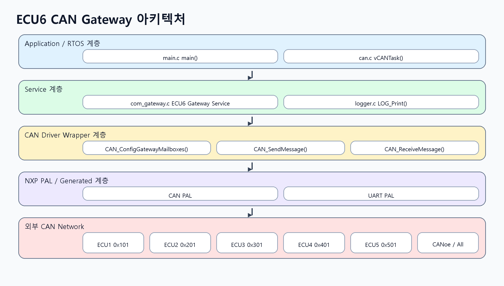

# Automotive Cluster ECU6 Gateway

MPC5748G 기반 FreeRTOS 환경에서 ECU1~ECU5의 CAN 상태 메시지를 감시하고, `GatewayStatus`, OTA 업데이트, 보안 접근 및 오류 진단 기능을 수행하는 ECU6 자동차 클러스터 게이트웨이 프로젝트입니다.



## 프로젝트 개요

이 저장소는 NXP S32 Design Studio for Power 기반의 `Automotive_Cluster` 임베디드 프로젝트입니다. 전체 요구사항 문서는 6개 ECU가 하나의 CAN 네트워크에서 동작하는 구조를 다루지만, 현재 구현과 문서화의 중심은 `ECU6 Gateway + OTA + Security Node`입니다.

ECU6는 다음 역할을 담당합니다.

- ECU1~ECU5의 주요 상태 CAN 메시지 수신 및 감시
- unknown CAN ID, checksum 오류, alive counter freeze, timeout 감지
- ECU6 상태 요약 메시지 `GatewayStatus` (`0x601`) 100 ms 주기 송신
- CANoe에서 들어오는 OTA 요청 `0x650` 처리 및 응답 `0x651` 송신
- seed/key 기반 보안 unlock, AuthByte 검증, 3회 실패 lockout
- verified OTA activation 이후 `ActiveSWVersion` 갱신

## 개발 환경

| 항목 | 내용 |
| --- | --- |
| MCU | NXP MPC5748G |
| IDE | S32 Design Studio for Power |
| RTOS | FreeRTOS |
| 주요 통신 | CAN |
| CAN 검증 | Vector CANoe, CAPL, DBC |
| 디버깅 증적 | Trace32 CMM scripts |
| Host test | Python `unittest` |

## 소프트웨어 구조

| 경로 | 역할 |
| --- | --- |
| `Sources/main.c` | platform 초기화 후 FreeRTOS task 생성 |
| `Sources/drivers/` | CAN, GPIO, UART PAL wrapper |
| `Sources/services/com_gateway.c` | gateway monitoring, OTA state machine, security logic |
| `Sources/services/ms_scheduler.c` | 10 ms / 100 ms / 1000 ms scheduler counter |
| `Sources/services/system_init.c` | clock, pin, UART, CAN 초기화 |
| `Generated_Code/` | Processor Expert generated code |
| `CANOE/` | DBC, CAPL simulator/test, panel bridge, CANoe report artifacts |
| `cmm/` | Trace32 init, gateway, OTA, security, interrupt, scheduler evidence scripts |
| `Tests/host/` | 하드웨어 없이 검증 가능한 ECU6 gateway/OTA logic unit tests |
| `Documentation/ecu6_gateway/` | 설계, 요구사항 상태, 테스트 리포트, 증적 문서 |

## CAN 인터페이스

| CAN ID | 방향 | 의미 | 처리 |
| --- | --- | --- | --- |
| `0x101` | ECU1 -> ECU6 | `BodyStatus` | checksum, alive, timeout 감시 |
| `0x201` | ECU2 -> ECU6 | `PowertrainStatus` | checksum, alive, timeout 감시 |
| `0x301` | ECU3 -> ECU6 | `SensorStatus` | checksum, alive, timeout 감시 |
| `0x401` | ECU4 -> ECU6 | `ClusterStatus` | checksum, alive, timeout 감시 |
| `0x501` | ECU5 -> ECU6 | `DiagnosticStatus` | checksum, alive, timeout 감시 |
| `0x601` | ECU6 -> CAN bus/CANoe | `GatewayStatus` | 100 ms 주기 송신 |
| `0x650` | CANoe -> ECU6 | `OTA_Request` | OTA/security command 수신 |
| `0x651` | ECU6 -> CANoe | `OTA_Response` | ACK/NACK 및 상태 응답 |

`GatewayStatus` payload는 gateway state, OTA/security/error flags, blocked message count, security error counter, active software version, RX mask, alive counter, checksum을 포함합니다.

## 핵심 기능

### Gateway Monitoring

- 허용 CAN ID: `0x101`, `0x201`, `0x301`, `0x401`, `0x501`
- 등록되지 않은 ID는 payload를 사용하지 않고 `BlockedMsgCnt`만 증가
- checksum은 CAN ID LSB와 `data[0..6]`의 XOR 값을 `data[7]`과 비교
- alive counter freeze와 monitored message timeout을 감지하여 `GatewayStatus`에 반영
- 모든 monitored ECU 메시지를 정상 수신하고 fault가 없으면 `NORMAL`, fault 발생 시 `DEGRADED`

### OTA / Security

- OTA command: `START`, `DATA`, `END`, `ACTIVATE`, `ABORT`
- security command: `REQUEST_SEED` (`0x10`), `SEND_KEY` (`0x11`)
- key 계산: `seed XOR 0xA5`
- locked 상태에서는 `OTA_START` 거부
- `OTA_DATA`는 AuthByte 검증 후 최대 256 bytes까지 저장
- `OTA_END`에서 저장된 OTA payload의 8-bit XOR checksum 검증
- checksum 검증 성공 후 `ACTIVATE`가 성공해야만 `ActiveSWVersion` 증가
- wrong key 또는 wrong AuthByte 3회 누적 시 3000 ms lockout

## 테스트 및 증적

### Host-side Unit Tests

하드웨어, CANoe, Trace32 없이 순수 로직을 검증하는 Python 테스트가 포함되어 있습니다.

```powershell
python -m unittest discover -s Tests/host -p "test_*.py" -v
```

현재 문서화된 실행 결과는 9/9 pass입니다.

| 테스트 영역 | 결과 |
| --- | --- |
| checksum 계산 및 검증 | Pass |
| unknown CAN ID blocked counter | Pass |
| alive counter freeze 및 recovery | Pass |
| monitored ECU timeout 및 recovery | Pass |
| seed/key unlock 및 START security gate | Pass |
| OTA checksum success/failure | Pass |
| security lockout 및 timeout recovery | Pass |

증적 파일: `Documentation/ecu6_gateway/evidence/host_unit_tests_2026-06-04.txt`

### CANoe Assets

| 파일 | 목적 |
| --- | --- |
| `CANOE/ECU1.can` ~ `CANOE/ECU5.can` | ECU1~ECU5 status message simulator |
| `CANOE/ECU6_Gateway_OTA.dbc` | ECU status, GatewayStatus, OTA, UDS frame definition |
| `CANOE/ECU6_Gateway_Test.can` | gateway 정상/오류/transport CAPL test |
| `CANOE/ECU6_OTA_State_Test.can` | OTA/security state machine CAPL test |
| `CANOE/ECU6_Panel_Bridge.can` | CANoe panel sysvar와 OTA request bridge |
| `Configuration1.cfg`, `Configuration1.stcfg` | CANoe configuration |

CANoe `.vtestreport` artifact는 존재하지만, 현재 문서 기준으로 readable PASS/FAIL export 또는 screenshot 증적은 추가 확인이 필요합니다.

### Trace32 CMM Scripts

| 파일 | 목적 |
| --- | --- |
| `cmm/init_debug.cmm` | reset/load/run-to-main |
| `cmm/test_debug.cmm` | 일반 runtime review |
| `cmm/gateway_debug.cmm` | gateway RX, blocked count, checksum/alive/timeout 확인 |
| `cmm/ota_debug.cmm` | OTA state, buffer, checksum, version 확인 |
| `cmm/security_debug.cmm` | seed/key, unlock, error counter, lockout 확인 |
| `cmm/interrupt_evidence.cmm` | FreeRTOS tick ISR, CAN ISR, GatewayStatus TX 증적 수집 |
| `cmm/scheduler_evidence.cmm` | 10 ms / 100 ms / 1000 ms scheduler counter 증적 수집 |

## 요구사항 상태 요약

현재 active scope는 Common, ECU6, ECU6 관련 Integration 요구사항을 포함한 35개 요구사항입니다.

| 상태 | 개수 | 의미 |
| --- | ---: | --- |
| Complete | 31 | 코드, 문서, 테스트 asset 수준에서 요구사항 충족 |
| Partial | 4 | 구현 또는 asset은 있으나 runtime evidence가 부족 |
| Missing | 0 | 의미 있는 구현이 아직 없는 요구사항 |

남은 주요 증적 항목은 다음과 같습니다.

1. S32DS build/flash/runtime evidence
2. CANoe readable test report 또는 trace screenshot
3. Trace32 interrupt/scheduler/gateway/OTA/security screenshot
4. full six-ECU integration runtime evidence

자세한 상태는 `Documentation/ecu6_gateway/requirements_status.md`를 참고하십시오.

## 주요 문서

| 문서 | 내용 |
| --- | --- |
| `Documentation/ecu6_gateway/design.md` | ECU6 gateway/OTA/security 설계 |
| `Documentation/ecu6_gateway/requirements_status.md` | 요구사항별 구현 및 증적 상태 |
| `Documentation/ecu6_gateway/test_report.md` | 테스트 asset, host test 결과, 남은 수동 검증 항목 |
| `Documentation/ecu6_gateway/presentation_study_guide_ko.md` | 발표 준비용 설명 자료 |
| `Documentation/ecu6_gateway/evidence/evidence_index.md` | 수집된 증적과 추가 필요 증적 정리 |

## 빌드 및 실행 메모

- S32DS에서 프로젝트를 import한 뒤 `Debug_FLASH` configuration으로 build합니다.
- 현재 repository에는 `Debug_FLASH/Automotive_Cluster.elf` 및 `.map` build artifacts가 포함되어 있습니다.
- scheduler counter 변경 이후 최종 Trace32 증적 수집 전에는 S32DS에서 다시 build하여 ELF symbol을 최신화해야 합니다.
- CANoe에서는 `Configuration1.cfg`를 열어 DBC, CAPL node, panel bridge 연결 상태를 확인한 뒤 gateway/OTA test를 실행합니다.
- Trace32에서는 `cmm/startup_dashboard.cmm`, `cmm/gateway_debug.cmm`, `cmm/ota_debug.cmm`, `cmm/security_debug.cmm`, `cmm/interrupt_evidence.cmm`, `cmm/scheduler_evidence.cmm`를 활용해 runtime evidence를 수집합니다.

## 현재 결론

코드와 테스트 asset 수준에서는 ECU6 gateway monitoring, OTA transport, seed/key security, OTA checksum verification, lockout, `ActiveSWVersion` update 기능이 대부분 구현되어 있습니다. 최종 완료 증적으로는 S32DS 실제 실행, CANoe readable verdict, Trace32 runtime screenshot, full integration trace가 추가로 필요합니다.
